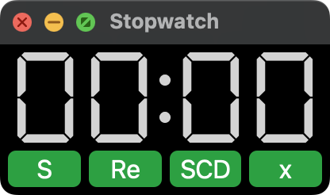

# StopWatch.py

就是一個計時器

## ---To User-------------------
### 如何使用
直接下載stopwatch.app，它就是一個可以直接在Mac中跑起來的應用程式了！
p.s. 點下APP的時候它會先閃退個兩秒才再次出現是正常現象

### 按鈕簡介


- S=Start
- P=Pause
- SCD=Swich to CountDown 倒計時 直接輸入要的時間
- SC=Swich to Count 正計時
- x=pin on top
- o=unpin


## ---To Developer--------------

### 目前概述
基本功能能實現，不過還有一些可優化和改進的，以及可加一些feature。

BTW 我現在Timer跟stopwatch這兩個名詞是混用的

### 早安你好我的朋

1. 確認已安裝 [Python3](https://www.python.org/downloads/)
2. 克隆這個倉庫：
   ```bash
   git clone https://github.com/username/repository.git
   ```
3. 進入專案目錄：
   ```bash
   cd repository
   ```
4. 創建並啟動虛擬環境：
   ```bash
   python3 -m venv myenv
   source myenv/bin/activate
   ```
5. 安裝必要套件：
   ```bash
   pip install -r requirements.txt
   ```
6. 改程式碼吧！
   ```bash
   python stopwatch.py #執行測試
   ```
8. 重建app
    ```bash
    # 先把舊的清掉
    rm -rf dist/ build/ *.spec 
    # build一個新app出來 (生成的 .app 文件會在 dist/ 資料夾中)
    pyinstaller --onefile --windowed --icon=icon.icns stopwatch.py
    # 如果想改icon也行，生一張png出來再丟到網路上convert程.icns
    ```

### 貢獻

如果你想貢獻，可以遵循以下步驟：

1. Fork 這個 Repository
2. 創建一個新分支：`git checkout -b feature-branch`
3. 提交更改：`git commit -m 'Add some feature'`
4. 推送到分支：`git push origin feature-branch`
5. 創建一個 Pull Request

## 授權

[MIT](LICENSE) © 2024 slimu